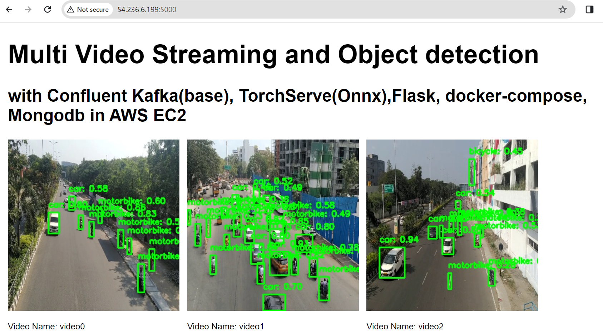

# Multivideo_Objectdetection_MLOPS_Project

**Youtube Playlist** : [Link here](https://www.youtube.com/playlist?list=PLaiyLZ9Xs1bzsHfMhjTSJD9Jfj2VwBXZU)

**Description** 

I am having a set of videos and kafka producer is taking and passing to kafka server then consumer consumes it. The consumer has torchserve part and then objects are detected by it and then stored in mongo db.

**its offline streaming project not real time streaming.** but can be made as real time streaming with modifications in producer part

### Procedure
    docker network create kafka-network

    docker compose -f kafka/docker-compose.yml build --no-cache

    docker compose -f kafka/docker-compose.yml up

    docker compose -f docker-compose.yml build --no-cache

    docker compose -f docker-compose.yml up

    Inference at http://localhost:5000

    Check if torchserve is enabled http://localhost:8081/models

To delete the containers 

    docker compose -f kafka/docker-compose.yml down
    docker compose -f docker-compose.yml down

EC2 docker installation

    sudo apt-get update -y

    sudo apt-get upgrade

    curl -fsSL https://get.docker.com -o get-docker.sh

    sudo sh get-docker.sh

    sudo usermod -aG docker ubuntu

    newgrp docker

## Note & Value added

if you use a better model with good dataset it can predict quality will be increased. I worked on integrating following parts in code as its a MLOPs project.

- Confluent Kafka(base) - docker and python based confluent kafka (i didnt use other features of confluent kafka)
- TorchServe(Onnx)
- Flask
- Flask socketio
- From data ingestion to evaluation stage
- dvc pipeline
- docker-compose
- Mongodb
- AWS EC2

- Kindly change the epochs in params.yaml file to 60 and then replace "trained_model_60epoch.onnx" with "detection.onnx" in Dockerfile for  using the model training with dvc repro. I dont have a gpu so i trained in colab and placed "trained_model_60epoch.onnx" file in git already.

- Kafka part can also be improved 

- In comming days i will try to create and explain part by part example how kafka producer and consumer commincates, how torchserve serves, etc in detail

## Github CI/CD
- it seems that docker compose with github CI/CD is not possible but you can always create more docker containers with [this type](https://github.com/ajithvcoder/Spaceship_Titanic_MLOps_Project/blob/main/.github/workflows/main.yaml) of CI/CD pipeline feel free to explore it 

### References

1. https://github.com/wingedrasengan927/Distributed-Multi-Video-Streaming-and-Processing-with-Kafka/tree/master
